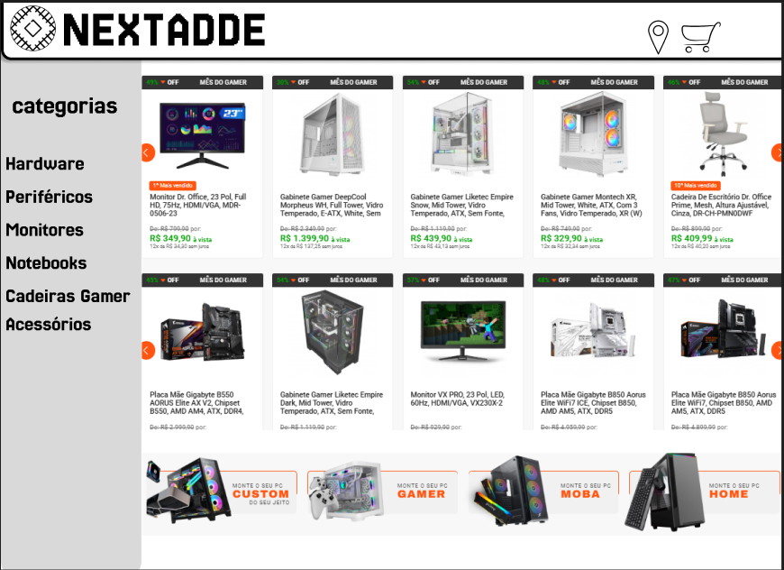

# Projeto Final - Implementação de Protótipo do Figma (NEXTADDE)

**Disciplina:** Desenvolvimento Web I  
**Professor:** Thomaz Maia  
**Instituição:** IFCE Campus Maranguape

---

## 👥 Equipe
* **Laurino Bonifácio**
* **Davi Mendes Medeiros**

---

## 🎯 Objetivo
Desenvolvimento de um e-commerce de hardware ("NEXTADDE") utilizando **HTML** e **CSS**. O projeto foca na estruturação semântica e estilização responsiva, baseando-se em protótipos visuais criados no Figma.

---

## 🖼️ Comparativo: Design (Figma) vs. Implementação (Code)

Abaixo, detalhamos a evolução do projeto, comparando o planejamento visual com o resultado final.

## 🎨 Comparativo: Design vs. Site Real

### 1. Página Inicial (Home)
| Protótipo (Figma) | Site Implementado |
| :---: | :---: |
|  |  |

### 2. Página de Detalhes
| Protótipo (Figma) | Site Implementado |
| :---: | :---: |
|  |

---

## 🛠️ Tecnologias e Estrutura
* **HTML5:** Uso de tags semânticas (`section`, `article`, `nav`).
* **CSS3:** Flexbox para layouts, variáveis de cor e reset CSS.
* **Estrutura de Pastas:**
    * `/css` (Estilos globais)
    * `/html` (Páginas secundárias)
    * `/img` (Assets e prints)

---

